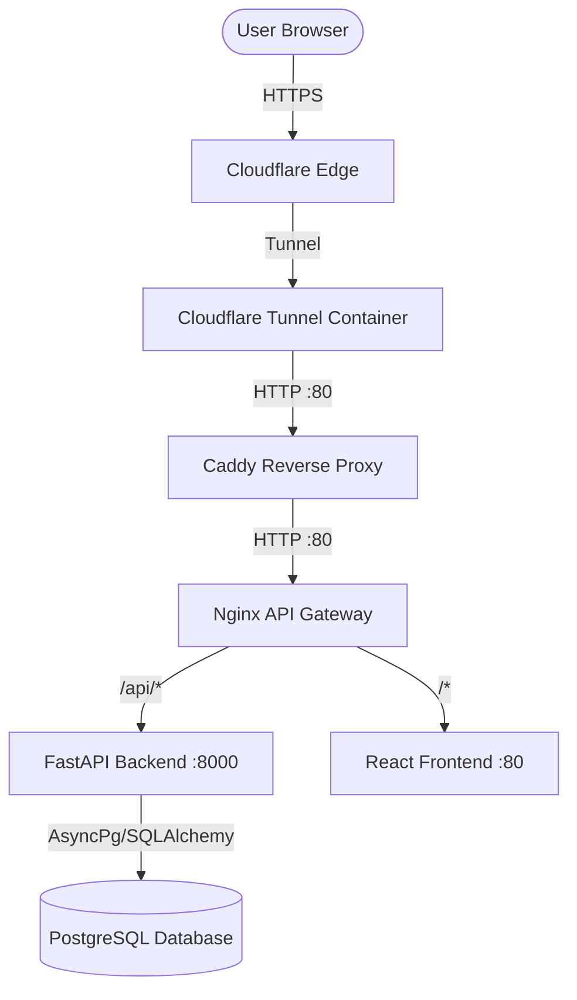

# Dinesh Textile ERP & CubeBook - Complete Developer Documentation

This repository houses the complete full-stack ERP and bookkeeping system tailored for textile manufacturing, sales tracking, logistics, and personnel management.

---

## 1. High-Level Architecture
The project is organized as a monorepo containing two full-stack applications:
1. **Dinesh Textile ERP (Main Application)**: A specialized ERP for textile manufacturing operations, handling yarn purchase, warp beam management, production planning (PPC), weaving/loom operations, fabric finishing, quality checks, despatching, invoicing, Eway bills, and employee/HR records.
2. **CubeBook (Auxiliary Application)**: A secondary ledger/bookkeeping web application.

Traffic routing, security headers, SSL/TLS, and domain exposure are handled via a containerized reverse proxy stack (Cloudflare Tunnel -> Caddy -> Nginx) to route traffic to the respective services.



---

## 2. Directory Structure Overview
Here is a high-level representation of the project's layout:

```text
dinesh-tex/
├── backend/                       # Backend applications (FastAPI)
│   ├── app/                       # Main ERP Backend Source
│   │   ├── api/                   # API v1 routes & endpoints
│   │   ├── core/                  # Security, database, configuration, dependencies
│   │   ├── models/                # SQLAlchemy database models (26 tables)
│   │   ├── schemas/               # Pydantic schemas (request/response validation)
│   │   ├── templates/             # Jinja2 templates (e.g., invoices/reports)
│   │   └── main.py                # Main FastAPI entry point
│   ├── cubebook-back/             # CubeBook Backend Source
│   │   ├── app/                   # Database, routers, schemas, models
│   │   └── requirements.txt       # Dependencies for CubeBook backend
│   ├── alembic/                   # Database migration files
│   ├── requirements.txt           # Main ERP backend python packages
│   └── Dockerfile                 # Backend production container configuration
│
├── frontend/                      # Frontend applications (React + Vite)
│   ├── src/                       # Main ERP Frontend Source
│   │   ├── components/            # Shared UI components
│   │   ├── pages/                 # UI pages grouped by business module (28 modules)
│   │   ├── services/              # API consumption layer (Axios)
│   │   ├── utils/                 # Frontend helpers (formatting, exports)
│   │   ├── App.jsx                # Router & base layout config
│   │   └── main.jsx               # Application entry point
│   ├── cubebook-front/            # CubeBook Frontend Source
│   │   ├── src/                   # Source files (Query, Zustand, components)
│   │   └── package.json           # Dependencies for CubeBook frontend
│   ├── package.json               # Main ERP frontend configuration
│   ├── tailwind.config.js         # Tailwind CSS configurations
│   └── Dockerfile                 # Frontend production container configuration
│
├── deploy/                        # Production orchestration configurations
│   ├── caddy/                     # Caddy reverse proxy config (Caddyfile)
│   ├── nginx/                     # Nginx gateway config (default.conf)
│   ├── docker-compose.yml         # Production multi-container composition
│   └── docker-compose.override.yml
│
├── Jenkinsfile                    # Jenkins CI/CD pipeline script
├── start_dev.sh                   # Development environment startup script (spins up all 4 components)
├── README.md                      # This file
└── .env                           # Environment configurations (DB URIs, secrets, etc.)
```

---

## 3. Technology Stack Detail

### A. Main ERP Application (Dinesh Textile ERP)

#### **Backend (Python / FastAPI)**
*   **Web Framework**: FastAPI (v0.115.0) — utilized for high performance, automatic OpenAPI documentation, and asynchronous handler support.
*   **ASGI Server**: Uvicorn (v0.30.6) — standard runtime for FastAPI.
*   **Database ORM & Driver**: 
    *   SQLAlchemy (v2.0.35) — Object-Relational Mapper.
    *   `asyncpg` (v0.29.0) — Asynchronous PostgreSQL client library.
    *   `psycopg2-binary` (v2.9.9) — Synchronous driver fallback (typically for migrations/seeding).
*   **Migrations**: Alembic (v1.13.3) — schema migration tracking.
*   **Authentication & Security**:
    *   `python-jose` (v3.3.0) — JSON Web Token (JWT) signature verification.
    *   `passlib` (v1.7.4) + `bcrypt` (v4.0.1) — Password hashing and validation.
*   **Data Validation & Config**: Pydantic (v2.9.2) & `pydantic-settings` (v2.5.2) — strict typing and validation.
*   **Utility & AI Integration**:
    *   `numpy` & `scipy` — Numerical computation.
    *   `scikit-learn` & `opencv-python-headless` — Image analysis (primarily in `design_ai`).
    *   `groq` — Integration with Llama-3 AI models.
    *   `weasyprint` — HTML-to-PDF conversion for report generation.
    *   `openpyxl` — Excel document parsing and exports.

#### **Frontend (React / JavaScript)**
*   **Bundler**: Vite (v6.0.0) — fast dev serving and building.
*   **UI Library**: React (v19.0.0) & React DOM.
*   **Routing**: React Router DOM (v7.1.0).
*   **Styling**: Tailwind CSS (v4.3.0) — utilizing the new `@tailwindcss/vite` and `@tailwindcss/postcss` compiler.
*   **Icons**: Lucide React (v0.460.0).
*   **HTTP Client**: Axios (v1.7.0).
*   **Data Visualization**: Recharts (v2.15.0).
*   **Document Generation**: jsPDF (v4.2.1) & jsPDF AutoTable (v5.0.8).
*   **Spreadsheets**: SheetJS/XLSX (v0.18.5).

---

### B. CubeBook (Auxiliary Application)

#### **Backend (Python / FastAPI)**
*   **Framework**: FastAPI.
*   **ORM**: SQLAlchemy & Alembic.
*   **Database**: SQLite/PostgreSQL support (uses `psycopg2-binary` and SQLite drivers).
*   **PDF Exports**: WeasyPrint.

#### **Frontend (React / SPA)**
*   **Framework**: React (v18.2.0) with Vite (v5.0.0).
*   **State Management**: Zustand (v4.5.0).
*   **Data Fetching/Caching**: TanStack React Query (v5.0.0).
*   **Styling**: Tailwind CSS (v3.4.0) with PostCSS/Autoprefixer.

---

### C. Infrastructure, Deployment & DevOps
*   **Orchestration**: Docker Compose (3.8).
*   **API Gateway / Proxy Hierarchy**:
    1.  **Cloudflare Tunnel**: Receives traffic from the external domain securely without exposing public ports.
    2.  **Caddy**: Acts as the local reverse proxy receiving traffic on port 80 and forwarding it to Nginx.
    3.  **Nginx**: Acts as the main security hub and API gateway. It applies security headers (XSS, CSP, Frame Options), increases upload limits (`50M`), and handles routing rules (`/api/*` maps to Python backend, `/*` maps to React build container).
*   **Database Service**: PostgreSQL (15-alpine) with volume mount persistence (`db_data`).
*   **CI/CD Pipeline**: Jenkins pipeline (`Jenkinsfile`) implementing build stages, Docker image generation, and remote container deployment.

---

## 4. Key Business Modules
The main ERP application is highly tailored to textile mills and manufacturing processes. These are implemented as distinct API routes and frontend pages:

1.  **Yarn Management**: Tracks `yarn_purchase` orders and `yarn_inward` receipts.
2.  **Warp Beam Management**: Registers warp beams and warp deliveries to looms.
3.  **Production Planning & Control (PPC)**: Connects buyer orders to loom schedules and tracks weaving operations.
4.  **Weaving / Loom Operations**: Logs production metrics from looms.
5.  **Cloth & Finished Fabric**: Manages cloth rolls, quality checking (On Table Checking), and finished fabric inventory.
6.  **Despatch & Logistics**: Organizes despatch planning, packing slips, goods releases, and generates Eway Bills.
7.  **Sales & Invoicing**: Formulates sales invoices and logs reports.
8.  **Design Management**: Manages fabric design patterns (`design_entry`), utilizing AI integrations for image processing (`design_ai`).
9.  **HR & Vehicle Management**: Handles employee profiles, master configurations, and transport vehicles.

---

## 5. Local Development & Setup Instructions

### Prerequisites
*   **Python 3.10+** (with `pip` and `venv`)
*   **Node.js 18+** (with `npm`)
*   **PostgreSQL 15** (or standard database client)

### Development Startup (Automatic)
The root folder includes a development script `start_dev.sh` to spin up all 4 components (ERP frontend/backend, CubeBook frontend/backend) simultaneously:

```bash
chmod +x start_dev.sh
./start_dev.sh
```

This starts the servers at:
*   **Main ERP Frontend**: http://localhost:5173
*   **Main ERP Backend**: http://localhost:8000
*   **CubeBook Frontend**: http://localhost:5174
*   **CubeBook Backend**: http://localhost:8001

### Manual Setup

#### A. Main Backend Setup
1. Navigate to the backend directory:
   ```bash
   cd backend
   ```
2. Create and activate a Python virtual environment:
   ```bash
   python -m venv venv
   source venv/bin/activate  # On Windows: venv\Scripts\activate
   ```
3. Install dependencies:
   ```bash
   pip install -r requirements.txt
   ```
4. Configure environment variables in `.env` (copy from backend root or system configuration).
5. Start the backend:
   ```bash
   python -m uvicorn app.main:app --reload --host 0.0.0.0 --port 8000
   ```

#### B. Main Frontend Setup
1. Navigate to the frontend directory:
   ```bash
   cd frontend
   ```
2. Install Node packages:
   ```bash
   npm install
   ```
3. Start the dev server:
   ```bash
   npm run dev
   ```
